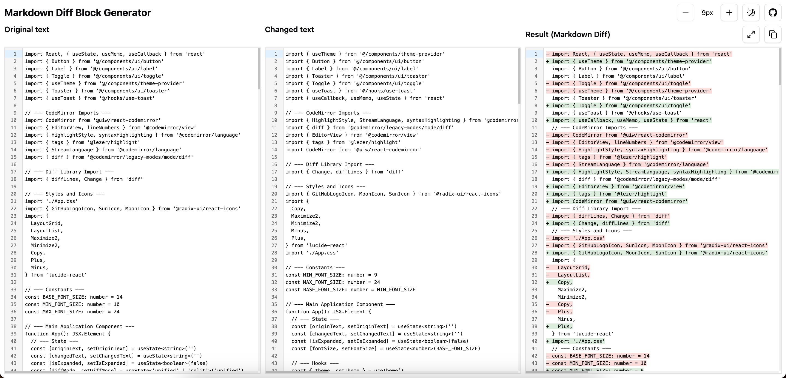

# Markdown Diff Block Generator

A simple, elegant tool for generating markdown diff code blocks from text comparisons. Perfect for documenting changes in READMEs, documentation, or GitHub comments.

## Screenshot



## Features

- **Inline Diff View**: Clearly visualize additions and deletions with + and - prefixes
- **Adjustable Font Size**: Customize text size for better readability
- **Dark/Light Mode**: Switch between themes based on your preference
- **Expandable View**: Focus on the diff output when needed
- **Copy to Clipboard**: Easily copy the generated markdown diff block

## Live Demos

- [Vercel Deployment](https://markdown-diff-block-generater.vercel.app/)
- [GitHub Pages](https://joisun.github.io/markdow-diff-block-generater/)

## How to Use

1. Enter your original text in the left panel
2. Enter your modified text in the right panel
3. View the generated diff in the result panel
4. Copy the result as a markdown diff block with the copy button

The generated output can be pasted directly into markdown documents and will render as a proper diff block.


## Development

This project is built with:
- React
- TypeScript
- CodeMirror for text editing
- diff library for text comparison
- Tailwind CSS for styling

### Running Locally

```bash
# Install dependencies
npm install

# Start development server
npm run dev
```

## License

MIT
